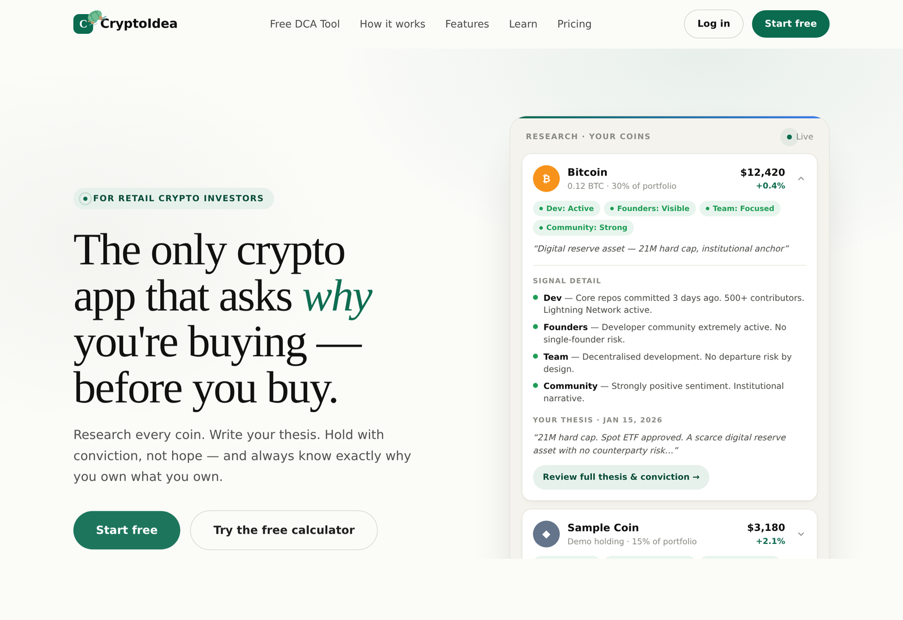
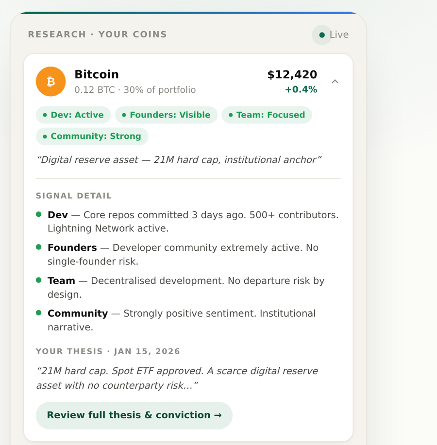

<div align="center">


# CryptoIdea

**Write your thesis before you buy.** A crypto portfolio tracker + research journal that makes you
justify every coin on fundamentals — so you invest with conviction, not hype.

[](#status--limitations)
[](LICENSE)
[](https://github.com/nrenre62/crypto-idea/actions/workflows/ci.yml)




</div>

## Why this exists

You know the burnt-out investor, because you've been one: chasing a 100x on a coin because the
timeline was loud, not because you understood it. You bought the hype and the community marketing —
and most of those coins went to zero.

**CryptoIdea flips the order.** Before a coin enters your portfolio, you write a short thesis: *why*
you're buying and *what would change your mind*. Every position becomes a decision you can defend
instead of a bet you can't. The app helps you judge the **real** state of a project — what's actually
shipping on GitHub, real volume vs. wash trading, real yield vs. emissions — so you see the investment
as it is, not as its marketing wants you to see it.

The goal is simple: **make better decisions and protect your capital.** Understand what you own,
avoid the ones that were never going to make it, and hold the rest with conviction.

<div align="center">

</div>

## What you can do

- **Track a portfolio** — multiple portfolios, live prices (via a cached CoinGecko proxy), cost basis, and real P&L.
- **Write & review theses** — a "why you bought it / what would change your mind" journal on every coin, with an intact / review / challenged status you revisit over time.
- **Research your holdings** — a Research tab with conviction signals, allocation and concentration, a risk read, and honest deterministic summaries built from *your own* numbers.
- **Learn** — a built-in library of investing lessons with XP, streaks, and quiz-gated progress.
- **Free DCA calculator** — a dollar-cost-averaging backtest on the landing page, no login required.
- **Install it** — it's a PWA: installable, works on phone and desktop from one responsive layout, light/dark.

## Quick start (local, no Firebase account needed)

Everything runs on your machine against the local **Firebase emulators** — you don't need a cloud
Firebase project to try it.

**Prerequisites:** [Node.js 22](https://nodejs.org/) and a JDK 17+ (the Firestore emulator needs Java).

```bash
git clone https://github.com/nrenre62/crypto-idea
cd crypto-idea
npm install
npm run seed        # one-time: seeds local test accounts into ./emulator-data
npm run start:all   # emulators + dev server, all local, one lifecycle (Ctrl-C stops all)
```

You should see:

```
VITE v8  ready
  ➜  Local:   http://localhost:3000        ← the app (hot reload)
✔  All emulators ready! View status at http://localhost:4000
```

Open **http://localhost:3000** for the landing page, or **http://localhost:3000/app** and sign in with
a seeded account — `free@test.com` / `test1234`. The Emulator UI at **http://localhost:4000** lets you
inspect the data.

> `npm run dev` alone runs only Vite, so `/api/*` calls fail — always use `npm run start:all` for the
> full stack. Seeded accounts persist across restarts (auto-imported/exported from `./emulator-data`).

## Deploy your own (Firebase)

CryptoIdea is built to run on **Firebase Hosting + Cloud Functions + Firestore**. To put your own copy online:

1. Create a Firebase project and enable **Email/Password Auth** + **Firestore** (production mode).
2. Copy `.env.example` → `.env` and fill in the `VITE_FIREBASE_*` web config (public by design).
3. Publish `firestore.rules` (the security boundary) and put a CoinGecko key in admin **Settings**.
4. `npm run deploy` (Vite build + `firebase deploy`). **Cloud Functions need the Blaze plan.**

Before a first real launch, read **[GO-LIVE-AUDIT.md](docs/product/GO-LIVE-AUDIT.md)** — it's the
ordered runbook, including the steps (Firestore region, PITR, App Check) that can't be undone if done
out of order.

## How it works

A multi-page Vite app with a Firebase backend. **Only the built `dist/` reaches the browser — no
server code or secret ever ships.**

| Piece | What it is |
|-------|-----------|
| `index.html` | Static marketing landing + the free DCA calculator (`#dca`). |
| `app.html` → React | The user app: portfolios, coins, transactions, Research, Journal, Learn, Account. |
| `admin.html` → React | A **separate** admin app at `/admin` (own login + custom-claim check) — not in the user bundle. |
| `functions/index.js` | Cloud Functions: the CoinGecko proxy (`/api/*`), admin + GDPR callables, scheduled cache jobs, and a dormant PayPal path (~50 functions; full contract in [`openapi.json`](openapi.json)). |
| `firestore.rules` | Deny-by-default security rules — the real access boundary, covered by tests. |

The frontend is **layered** (`api` → `hooks` → `components`, with pure `utils`); details in
[`src/ARCHITECTURE.md`](src/ARCHITECTURE.md) and the canonical
[`ARCHITECTURE.md`](docs/decisions/ARCHITECTURE.md). A map of the whole codebase is in
[`CODEBASE-MAP.md`](docs/product/CODEBASE-MAP.md).

## Key decisions & trade-offs

- **Market data is flat-cost, not per-user.** One shared CoinGecko cache (`cache/universe`, ~3,000
  coins) backs every user and the calculator, so upstream cost (~44k calls/month) is the same for 100
  or 10,000 users. **Trade-off:** full price freshness needs a paid CoinGecko plan; the free tier keeps
  only the top coins 5-minutes-fresh.
- **Security lives in the rules, not the UI.** Firestore rules are the boundary: deny-by-default,
  server-only fields (`tier`, billing, soft-delete), and counter-enforced limits. **Trade-off:** every
  feature needs a rules test — but a bypassed client check can't leak data.
- **Deterministic-first, AI-off.** The Research summaries are computed honestly from your own numbers
  with **no LLM**. **Trade-off:** less "smart", but free, private, and it can't hallucinate a price
  target. Live AI is not enabled — see [AI.md](docs/product/AI.md).
- **Free launch, dormant paid code.** The Pro/Premium tier + PayPal code exists but is switched **off**
  (`paidPlansEnabled`). **Trade-off:** no revenue path at launch, but no untested payment flow and no
  legal exposure. See [BILLING.md](docs/decisions/BILLING.md).
- **Built test-first, one PR per change.** Acceptance criteria become failing tests, then code makes
  them green. **Trade-off:** slower per feature, but the behavior stays pinned and regressions are caught.

## Tests

```bash
npm run test:unit         # ~950 Vitest tests: components/hooks/pure logic (jsdom, no emulator)
npm run test:rules        # Firestore security-rules tests (Firebase emulator)
npm run test:integration  # data layer + live callables over HTTP (emulator)
```

CI (`.github/workflows/ci.yml`) runs all three tiers on every push. The `:solo` variants
(`test:rules:solo`, `test:integration:solo`) run on isolated ports so tests work while a full
`start:all` stack is up.

## Status & limitations

**Version 1 (beta).** This is a personal project taken live on a real domain so it can be tested as a
real application, and open-sourced (MIT) so anyone can self-host it, rebrand it, and run it on their
own servers. Because it ships as-is, there may be bugs the author doesn't know about.

- **Free only.** Everyone is on the **Starter (free)** plan. Paid tiers exist in code but are **off**
  and their payment flow is **not tested end-to-end** — it will stay off. ([BILLING.md](docs/decisions/BILLING.md))
- **AI is off.** The Research tab uses deterministic summaries; live AI is not enabled. ([AI.md](docs/product/AI.md))
- **Privacy/Terms are optional** (free Termly embeds, off by default) and, like billing and AI, are
  not active out of the box. ([LEGAL.md](docs/product/LEGAL.md))

## Privacy & data rights

Self-service from **Account → "Privacy & your data"** (acts only on your own account): **export** your
data (CSV holdings summary or full JSON), and **delete** your account into a **30-day recovery trash**
before permanent erasure. Admins only ever see aggregate, operational data — never your holdings.

## Disclaimer

**Not financial advice.** CryptoIdea is a research and record-keeping tool — it never recommends buying
or selling anything, and most crypto assets go to zero. The software is provided **"as is" with no
warranty**; the author is **not responsible** for any loss, bug, or failure, whether you use the live
site or run your own copy. Full statement: [LEGAL.md](docs/product/LEGAL.md).

## Documentation

| Area | Doc |
|------|-----|
| Architecture & codebase map | [ARCHITECTURE.md](docs/decisions/ARCHITECTURE.md) · [src/ARCHITECTURE.md](src/ARCHITECTURE.md) · [CODEBASE-MAP.md](docs/product/CODEBASE-MAP.md) |
| API surface & keys | [API-SECURITY.md](docs/security/API-SECURITY.md) · [openapi.json](openapi.json) |
| Security & data isolation | [SECURITY-AUDIT.md](docs/security/SECURITY-AUDIT.md) · [ISOLATION.md](docs/security/ISOLATION.md) |
| Billing (dormant) | [BILLING.md](docs/decisions/BILLING.md) · [PRICING.md](docs/decisions/PRICING.md) |
| AI status & roadmap | [AI.md](docs/product/AI.md) |
| DCA calculator | [CALCULATOR.md](docs/product/CALCULATOR.md) |
| Legal / privacy / disclaimer | [LEGAL.md](docs/product/LEGAL.md) |
| Going live | [GO-LIVE-AUDIT.md](docs/product/GO-LIVE-AUDIT.md) |
| Design system | [DESIGN-PASS.md](docs/design/DESIGN-PASS.md) · [RESPONSIVE-DESIGN.md](docs/design/RESPONSIVE-DESIGN.md) |

## License

[MIT](LICENSE) © 2026 Mark Tomanok (nrenre62). Free to use, copy, modify, and self-host — just keep
the license notice. Change the branding and name and make it your own.
